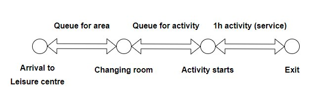
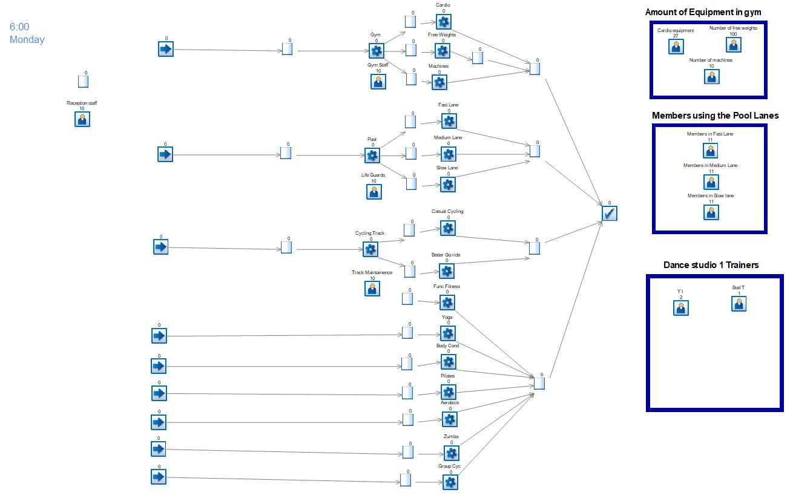
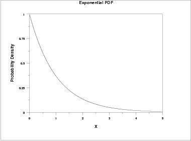

<!-- set knitr options here -->

```{r setup, include=FALSE}
knitr::opts_chunk$set(echo = TRUE)
```

<!-- main body starts here -->

\pagebreak

# Introduction {#intro}

The *COVID-19 pandemic* has brought this fast-moving world to a standstill. The impact of this pandemic is massive, and the only strategy to curb the rapid spread of the disease is to follow social distancing. The imposed lockdown, resulting in the closure of business activities, public places, fitness and activity centers, and overall social life, has hampered many aspects of the lives of people including routine fitness activities. 
However, as gyms and fitness centers reopen, a regular visit for a workout looks different today. Often, appointments are required to limit the number of individuals in the building at one time, and cleaning regimens have become more thorough to provide patrons a higher standard of cleanliness, and thus, peace of mind. However, policies do vary among boutique fitness brands and mass market gyms. In fact, some of these differences are not only shining a light on what policies work best, but also the particular gyms that may be best-positioned to survive the COVID-19 pandemic. While people may find themselves in different weight classes at the gym, COVID-19 is also peeling back the curtain and exposing a different type of class divide as well—how smaller, more expensive boutique fitness studios with scheduled classes and limited capacity may be benefiting from having a more controlled environment. In addition, because these boutique fitness studios are pricier, they may also have additional resources—including a higher staff-to-patron ratio—and the time between set classes to conduct more frequent cleaning practices.

**Maindy Leisure Center** is a facility that provides amenities like Gym, Swimming Pool, Cycling Track and other fitness classes like Zumba, Aerobics, Pilates, Yoga etc. The aim of this report is to build a model using simul8, to see where we can maximize the resources being used so that the system works more efficiently. Considering the limitation of allowing only a certain number of people in a closed space, it is important to **simulate** and **identify** the **optimum resources** that should be used within a fitness center while following the social distancing regulations.


# Background {#sec:background}

Managers and specialists have focused on optimising the utilisation of the resources and availability of their spaces in order to ease the application of self distancing rules. These circumstances offer a good opportunity for simulation and optimization work as managers and gym instructors need to cope with the downsized capacity of their centers at the time they try to reduce idle time on equipment and resources that cannot be accessed due to restricted capacity.

The present work will look into the aforementioned leisure centre capacity, resources, staffing to present a solution to optimise these resources. More information about UK government guidance for leisure centres can be found in Appendix III.


# Leisure centre business layout


## Elements describing the simulation

- Entities: Customers / leisure centre users, attending the centre to perform a 1h duration sports activity of their choice.
- Activities: Gym, swimming, or classes, as described below.
- Events: Arrival, Start activity, end activity, leave
- Queue: The activities are grouped in different areas depending of their nature and equipment needed (i.e. swimming can only take place in the pool). The queues are to enter the area where the activity will take place, as described below.
- Resources: Depending on the activity, these will be staffing (monitors) or equipment (bikes or pool capacity).
- Duration and clock time: All activities will have a fixed duration of 1h, and we will assume that all users perform their activities until completion.

{width=80%}

## Activities and resources


The centre is divided in 4 different areas. Each area offers different activities that may share resources in between them. We work under the assumption that each member attending the centre will only use **one** area when visiting the center, after having booked a **one hour slot**. In order to simplify the model we assume that every user will carry out one and only one activity.


- The list of available activities per area are shown in the following table:

| Gym              | Cycling track     | Swimming            | Studio      |  
| ---              | -------------     | --------            | ------      |    
| - Machines area  | - Casual cycling  | - Swim for fitness  | - Yoga      |  
| - Weight lifting | - Better go ride  |   (3 lanes)         | - Aerobics  |                   
| - Cardio         |                   |                     | - Pilates   |                   
|                  |                   |                     | - Circuits  |                   
|                  |                   |                     | - Zumba     |                   
|                  |                   |                     | - Box fit   |


- The list of resources linked to each activity are shown below:

| Gym                   | Cycling track     | Swimming            | Studio               | 
| ---                   | -------------     | --------            | ------               |    
| - Machines            | - Equipment       | - Lane capacity     | - Class instructors  |    
| - Cardio equipment    |                   |                     |                      |             
| - Free weight racks   |                   |                     |                      |                                      


# Data collection and preparation

## Problem definition


Most issues are common to many leisure centres and have been addressed by the centre manager and his main concerns/objectives. The scope of this work is **to perform one improvement action in each of the gym areas**. These improvement oportunities have been identified by **observation when visiting the centre**, speaking to the **business manager about his concerns**, and randomly **asking users about their experience** when visiting the gym and experiencing queueing times.


1. **Gym**: Identify areas where more resources are required (i.e. gym equipment)
The objective is to reduce queue times for users performing the **free weights** activity. This is the area identified as a main issue.


2. **Pool**: Convolution of Swim Lanes:
Customers may tend to saturate one swimming lane depending of their preference on swimming speed. Again, by observing how many members populate each lane we can decide whether the size of these lanes need to be redesigend to reduce congestion. The **fast lane** is frequently saturated and the objective for this area is to reduce queue times for users using this lane.


3. **Cycling track**: Compare queue times between the two activities carried out in this area.
As only two activities take place in the cycling track, we will run a simulation to see whether queue times are different to see if resources need to be redistributed.


4. **Studio**: Several activities/classes take place in the studio, but not all of them have the same number of instructors/staff.
- Some of the exercises like zumba and pilates have same instructors so by looking at the data we can merge two - classes of the same type which will result in decrease of one or two trainers
- Also for the classes which have a waitlist we can simply just suggest that number of trainers to be increased this is not actually resource optimization but this way we can optimize queue in the waitlist


## Data collection

Training times and attendance have been collected empirically with visits at the leisure centre. Collected times have been used for sampling purposes only as the centre owner showed concers on whether this activity would have an impact in customer satisfaction.

Sample data manually collected, area capacity and resources breakdown are shown in Appendix I.

\pagebreak


# Simulation Model


## Assumption and rules

We worked under the assumption that each activity is a single booking slot with a fixed duration of 1h. Customers won't be allowed to book more than one slot per day, and they will always complete the whole activity (one hour).

In additon, the model works under the condition that **all areas are always fully occupied.** For example, having the gym a capacity of 40 users, the scheduled arrivals will always feed the areas until reaching this maximum capacity.


## Arrival times

- **Arrival times** have been scheduled in accordance with the phone app **Better UK**, that customers use to book slots at the centre. They will book 1h slots, starting **any time from 06:00 to 20:20, at intervals of 10 minutes**. 

- **Scheduled arrivals**: With a daily program running **from 06:00 to 20:20**, new customers are allowed to get into any of the areas at intervals of 10 minutes. The batch size (number of customers allowed to get in at every slot) will vary trying to reflect real life attendance: The first batch will be 6 customers, followed by 3 customers per slot until 14:00, then 5 per slot until closure at 20:20.


## Simulation running times

- The model will run for **48 hours** to account for day to day variability. Model units have been set up in **minutes**.


## Layout

- The **Simul8 model** has been deployed using a queuing system as per the aforementioned description:

{width=80%}

1.Entries: The system has 4 different entries corresponding to each of the areas in the leisure centre. Users will show themselves into the area they have booked their slot for, at arrival.

2.Area queue: The first queue a user will find is the area queue. The purpose of this queue in the model is to model the distribution of users that will choose a different activity. For example, from the gym queue, 60% of users will go for free weights, 20% for cardio and 20% for machines. These queues can also represent the fitting rooms for people to get ready for their activity of choice.


### Gym

- The gym has a capacity of 40 users at the time.
- We assume that people will attend a **single activity** out of the three (to represent this, we say they wouldn't need to queue in case of going for a second).
- Utilization of different areas has been modelled using a routing out rule.

| Gym activity      | Route out (%)     | Max resources |
| ---               | -------------     | ------------- |
| - Free weights    | - 60              | - 16          |
| - Machines        | - 20              | - 13          |
| - Cardio|         | - 20              | - 13          |


### Pool
- The pool has a capacity of **33 users at the time**. Initially the capacity is divided equally between the three lanes, this is 11 users each. However, in order to better reflect the actual use of this facility, we are **setting up the capacity as 9 for the fast lane and 7 for the other two**. The reason for this is because when collecting data and observing real people use, it was found that the fast lane was heavily used. This will also help us to run a simulation with capacity changes as discussed in the experiment section.

- There is a queue at pool arrival from which all users will route out as a percentage, being 50% of users going for the fast lane, and 25% each for the remaining two. The queue at pool arrival, that we are using to set the route out sequence, represents the fitting rooms and lockers, therefore all users will need to queue at this point regardless of which lane they prefer to use. 

| Lane              | Route out (%)     | Max resources |
| ---               | -------------     | ------------- |
| - Fast lane       | - 50              | - 9           |
| - Medium lane     | - 25              | - 7           |
| - Slow lane       | - 25              | - 7           |

\pagebreak

### Cycling track
- The cycling track offers two activities: Better go ride (25% attendance) and casual cycling, where the rest of users go (75%). Same as with the pool, there is a queue before the activity of choice that represents reception, resources allocation, and routing out. The resources are the number of bikes (10) shared for both activities.


### Dance studio and cycling studio
- Each activity has already been allocated to a specific room, therefore users who have already book a slot for their class can go to that room directly. Hence there is no general queue for the dance studio, but for each of the classes.

| Activity        |  Trainers | People per class |
| ------          | ------    |     -------      |
| - Yoga          |  1        |15                |
| - Aerobics      |  1        |15                |
| - Pilates       |  2        |11                |
| - Circuits      |  3        |10                |
| - Zumba         |  2        |10                |
| - Box fit       |  2        |15                |
| - Group cycling |  1        |15                |


## Modelling and inter arrival times

- Arrival times are modelled following an **exponential distribution**[^1]: $$ f(x; \lambda) = \lambda e^{-\lambda x} | x\ge 0$$

We are using this distribution to model the arrival queue at each activity. The expected value $E(X) = 1/\lambda$ will help us to model the hourly inter-arrival times. As per the scheduled arrival plan discussed bellow, new users are allowed to get in every 10 minutes, this is 6 arrivals per hour, $\lambda = 1/60$. Exponential distributions have been applied to all queues in the model, and fixed time for each of the activities (60 mins).

{width=40%}

[^1]: The exponential distribution is the most suitable choice in queueing theory.


## Strategy and approach


Once the data was collected and the activity flow diagram was complete, thought was then given to the creation of the model itself. The simulation software Simul8 was used to form the model. This is a process-based software, meaning that the entities flow through the model until they are blocked, either by a time-based obstacle or for a condition to become true.

From the data it was decided that there were three major areas that the model should cover: resources and queueing size. The collected data enabled probability distributions to be placed on these events so that the element of randomness was accounted for in the model.

Several simulation runs will be performed following a different strategy for each area as described above.


# Experiments and tests


## Verification & Validation


### Gym

As previously stated, our focus is the **free weights** activity. The current maximum resources in this area is 16 (16 racks or users working out simultaneously). When visiting the facilities it was observed that there is space enough to increase the resources up to *26* racks. When running the simulation under these new conditions, it was found that **queue times were reduced by 8% therefore this solution/investment was adviced to the site manager.**.

### Pool

The strategy for this area was to **ease the use of the fast line**, as this was heavily congested when collecting data. The strategy was to reduce space in the other two lanes (medium and slow speed) consequently increasing the size of the fast lane. To represent this in the Simul8 model, resources were redistributed as follows:

|Lane    | Initial resources | New resources |
| -----  | ------            | ------        |
|Fast    |9                  |13             |
|Medium  |7                  |5              |
|Slow    |7                  |5              |

Re-running the simulation under these conditions **reduced the queue times from the last lane by 30%**. This action was adviced to the site manager.


### Cycling track

Queue times between both activities were found similar, as a result no resource re-distribution would result in a balance improvement.


### Studio 

The main action for this area was to redistribute the trainers/instructors into different classes.

The **yoga** activity, whose resource allocation was initially 3 trainers, was found to have an utilization of 11% only.


\pagebreak


# Conclusions
 


\pagebreak


# Appendix I.
- Data collection


\pagebreak


# Appendix II.

## Scheduled arrival times

Arrival times in the Gym and Pool areas are scheduled as follows:


```{r message=FALSE, warning=FALSE, include=FALSE, paged.print=FALSE}
library('lemon')
knit_print.data.frame <- lemon_print
```


```{r echo=FALSE, message=FALSE, warning=FALSE, paged.print=FALSE, render=lemon_print}

library('readr')
library('dplyr')


df_gym <- read_csv('scheduled_arrival_times/gym_arrival_schedule.csv')
df_pool <- read_csv('scheduled_arrival_times/pool_arrival_schedule.csv')
df_cycling <- read_csv('scheduled_arrival_times/cycling_track_arrival_schedule.csv')

print('Gym arrival schedule:')
df_gym

print('Swimming pool arrival schedule:')
df_pool

print('Cycling track arrival schedule:')
df_cycling

```


\pagebreak


# Appendix III.

More information about the UK government advice and guidance for leisure and sport centres can be found in the below link:

[https://www.gov.uk/government/publications/guidance-on-coronavirus-covid-19-measures-for-grassroots-sport-participants-providers-and-facility-operators/guidance-on-coronavirus-covid-19-measures-for-grassroots-sport-participants-providers-and-facility-operators]

\pagebreak


# Citations 
See for example [@nelson01] and [@pidd01].


